# Hacking a libre wireless dongle into the Samsung Chromebook Plus V1 aka Gru-Kevin

## Why
- add a usb wifi dongle without losing a usb port or dealing with an external dongle
- get better signal than a small usb dongle by re-using the built in antennas

My previous guide for this sort of thing on the c201: https://github.com/SolidHal/AsusC201-usb-wifi-from-webcam
The big difference here is that I used a very tiny usb hub to keep the webcam. Webcams are now important. Thanks 2020.
Also instead of using a deconstructed USB dongle, I use an internal ar9271 module with antenna plugs

## Requirements 
- Soldering Iros
- Wifi USB dongle that is supported by the ath9k open source firmware and driver. These ones are reliably found:
  - internal module: VIA VNT9271B6050 USB Embedded Wi Fi EMIO-1533-00A2
  - usb dongle: VNT9271BU0DB 00GO27100BU2B0D0
  - mfg site: https://www.viatech.com/en/products/accessories/wireless-accessories/
  - data sheet: http://cdn.viaembedded.com/products/docs/accessories/VIA_VNT9271_EMIO-1533_USB_Wi-Fi_Dongle_Module_datasheet_v151104.pdf
  - example sources:
     - http://www.sierraic.com/VNT9271B6050?utm_source=octopart&utm_medium=cpc&utm_campaign=octopart_2019&utm_term=VNT9271B6050
     - https://www.ebay.com/itm/2x-VIA-VNT9271-MODULE-VNT9271B6050-WiFi-802-11-Module-b-g-n-CCAI11LP0060T8/183751443778?hash=item2ac8708542:g:W2gAAOSwImRYZQE0
  - A nanohub: https://muxtronics.nl/nanohub.html
    - Note: the nanohub supports 3.3v (hub functional down to 3.08v)
  - Some form of electrical tape (preferably the plastic-y clear yellow stuff)
  - Some fine wire, I like magnet wire.
  - a small tipped pair of tweezers
  
## Instructions

First disassemble the laptop, removing the battery and logic board. You will want the logicboard out of the way for much of this work. 

Next to find our usb to borrow. Fortunately like on the c201 the webcam is usb. Unfortunately the webcam is run along with the display lvds. After a lot of research, I came up empty handed. I looked for any documentation about the logic board or the display cable in use, but nothing came up. 

I knew the display and webcam wires had to split up somewhere, so I carefully popped the plastic bezel at the bottom of the screen off. There was the split, with a large bundle going to the lcd and a smaller bundle going somewhere under the display. I wanted to confirm these were the webcam wires, but to do so required removing the glass and lcd which were glued down. 

Pretty sure that the webcam usb wires were in that smaller bundle, I carefully cut a slit in the shielding. Inside were 7 wires, which was a much narrower set of wires to guess at. 
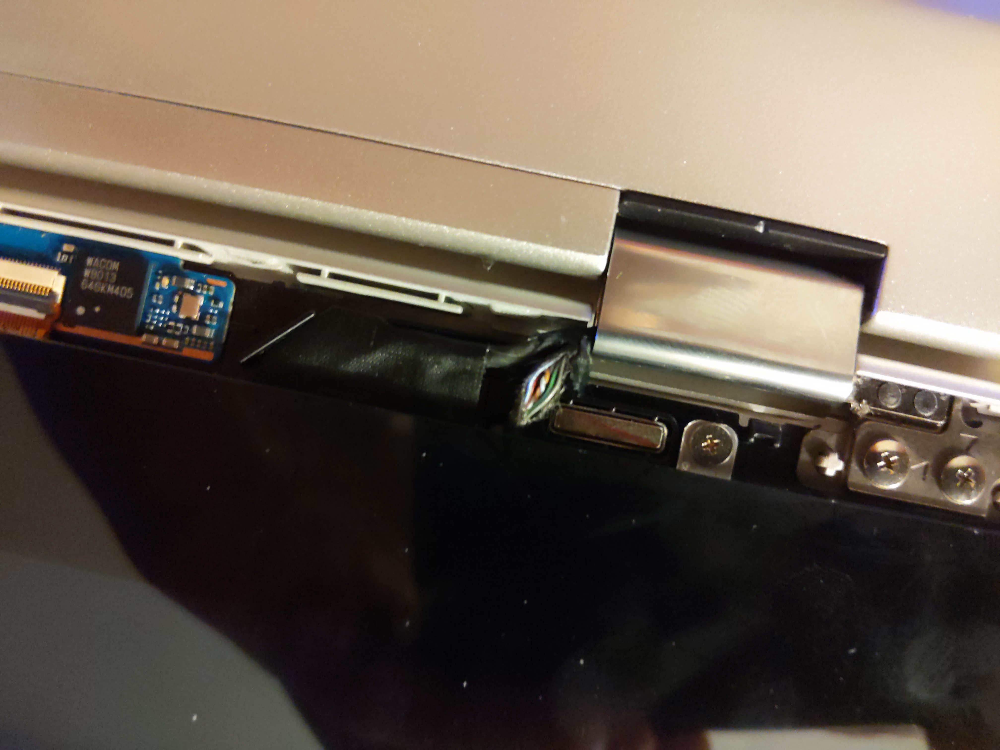

Still, USB 2 is only 4 wires so I still had some guessing to do. USB is VCC, D+, D-, and GND. I was pretty sure that the red was VCC and the black was ground but which ones were D+ and D-? Well, a common technique to decrease noise in long thin data cable runs is to twist the D+ and D- lines. That would mean the orange and white are D+ and D-. 

Going back into the base of the laptop, peel back the shielding on the lvds cable. Find the twisted orange and white pair and seperate them from the larger bundle. 

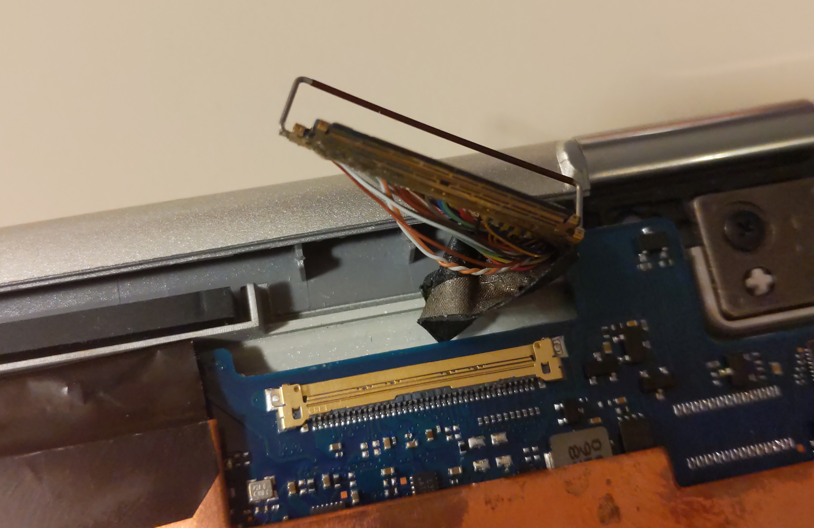

There are many red wires in the bundle, but we can guess the one right by the twisted pair is the VCC we want. 
Carefully cut these three wires and solder magnet wire to the end connected to the logic board. I used some electrical tape to protect the surrounding area while soldering. 

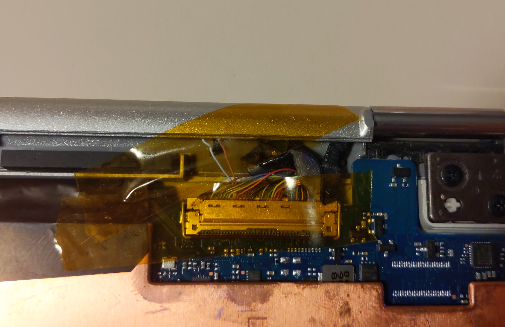

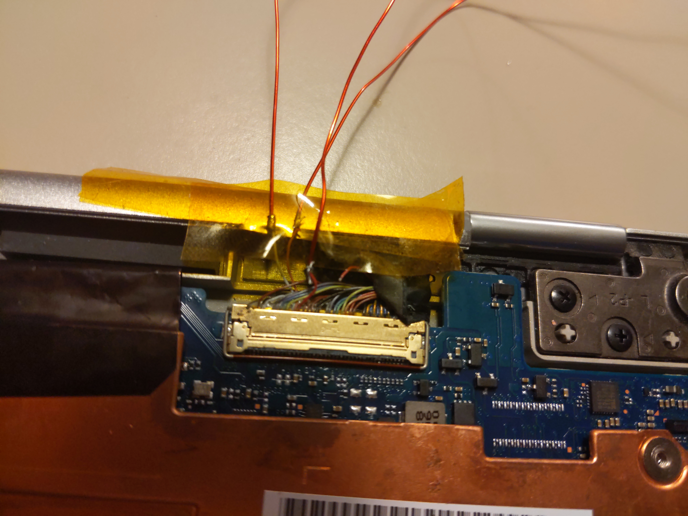

Here is the pinout:
- RED : VCC
- ORANGE : D-
- WHITE : D+

As a sanity test, and to confirm that we have the correct wires, solder them to a cheap flashdrive or some other unwanted usb device. Pick something as ground for now. Heres the best photos I could get of the delicate setup I had while testing: 

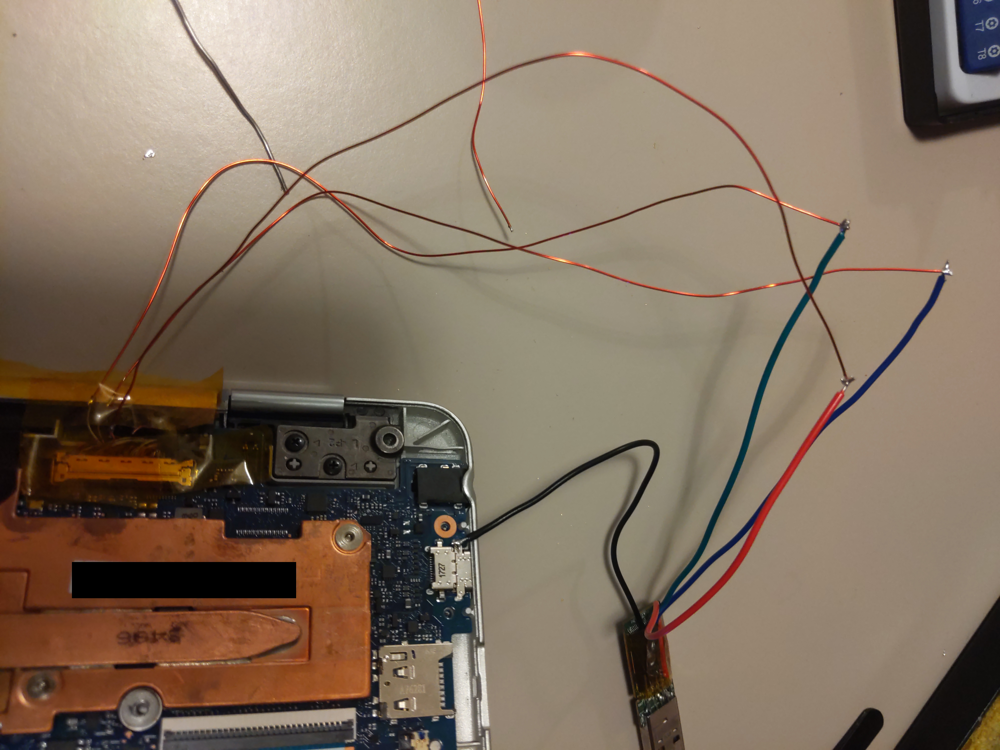

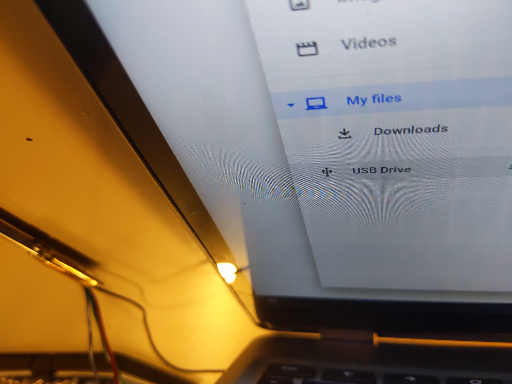

Great, it works! 

Now, where to put the hardware we want to stuff in? The nanohub can hide in the hingecover between the antennas and the lvds connector if we remove the of the cases structure. 

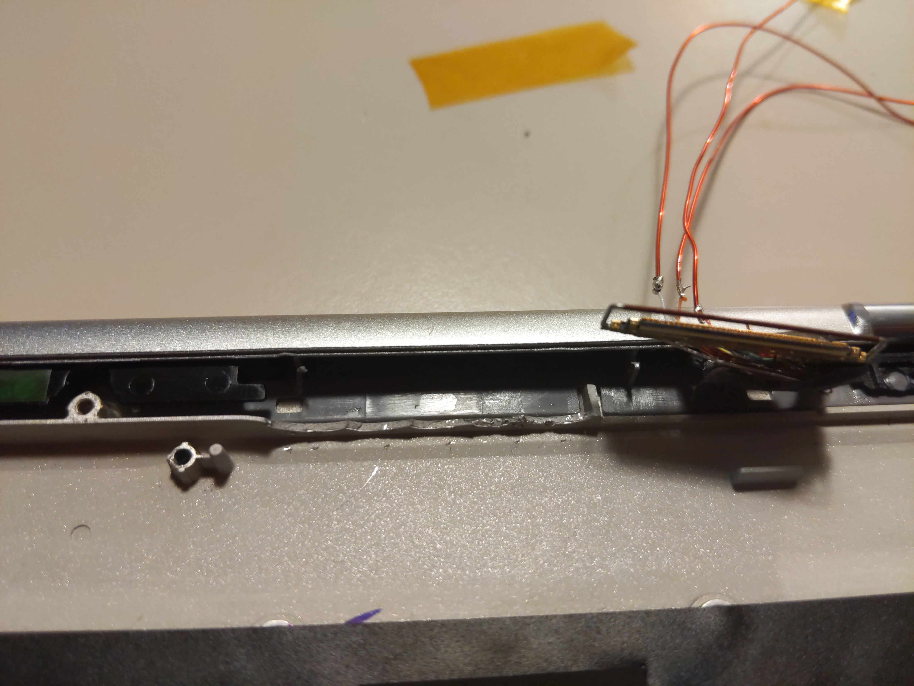

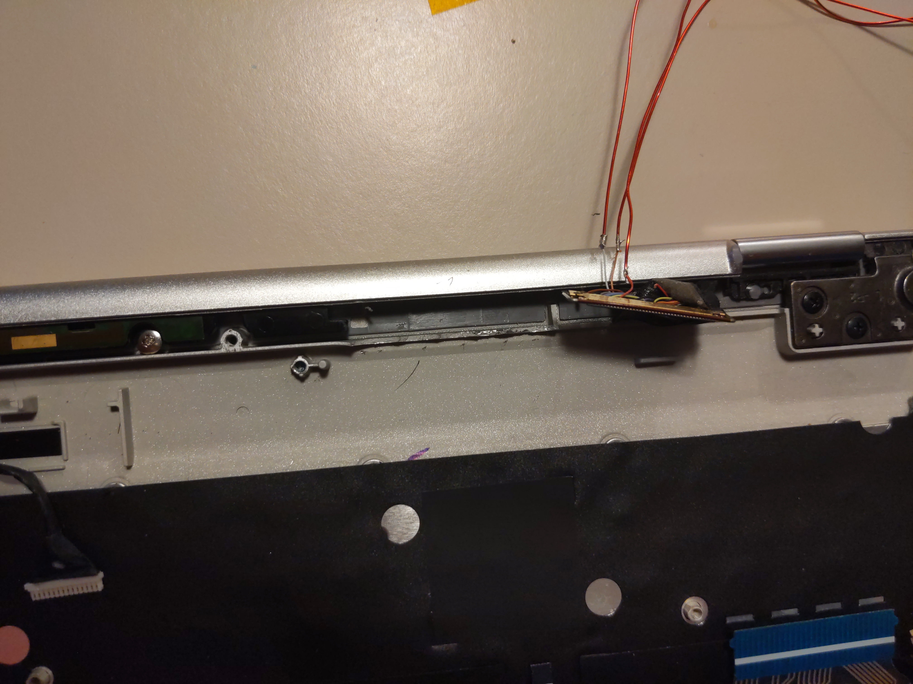

Wire up the nanohub, ensuring the wires from the lvds connector go the the input side of the nano hub

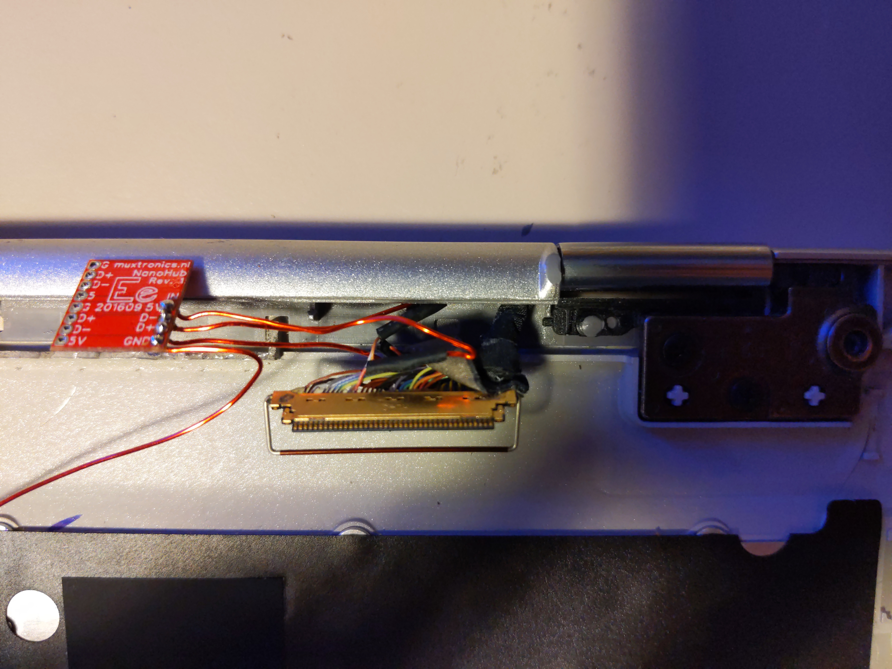

Solder a long wire to the ground for now, we can find a nice spot for one later.

Now time to figure out the pinout of the wifi module and test out the speeds. On mine, with the main ar9271 chip facing up and the antenna connectors on top the pinout from left to right is 
`GND, D+, D-, Vcc`

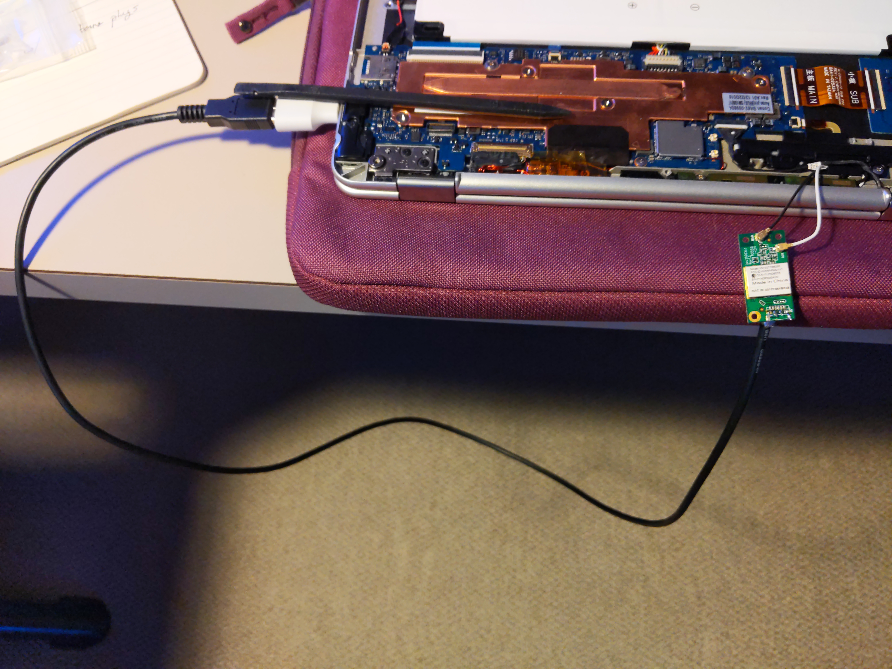

Running PrawnOS (https://prawnos.com) or another distro with ath9k support we can test out the antennas and wiring right on the Samsung chromebook. I observed a doubling in wifi speeds using this module with external antenna vs just a small dongle. That alone is worth it to me, and might mean I do this to my c201 as well... 

Next, run wires from one of the output Vcc, D+ and D- to the other side of the wires we cut in the lvds. The ground wire is still somewhere in that bundle, so no need for a new one.

Finally, time to find a spot to keep the module. It is a bit larger than the usb dongles I have stuffed into machines in the past, and now it also needed to be near enough for the antenna cables to reach. The gap between the main logic board and the smaller daughterboard seemed perfect. Connect wires between the other output on the nanohub and the wifi dongle. Wrap the nanohub in electrical tape to prevent shorts. 

I taped over the flex cable to protect it from the wifi modules and found a way to route the wires mostly under the board. If you don't care about the pen at all, you may be able to remove it and its housing to get an even better spot for the wifi dongle. Since I was trying to keep all of the laptops functionality, I didn't go this route.

Remember our ground wire? Well, the housing of the now useless original wifi card makes for an easy place to solder down a ground. 

Here is the final layout with all of the wires routed. 

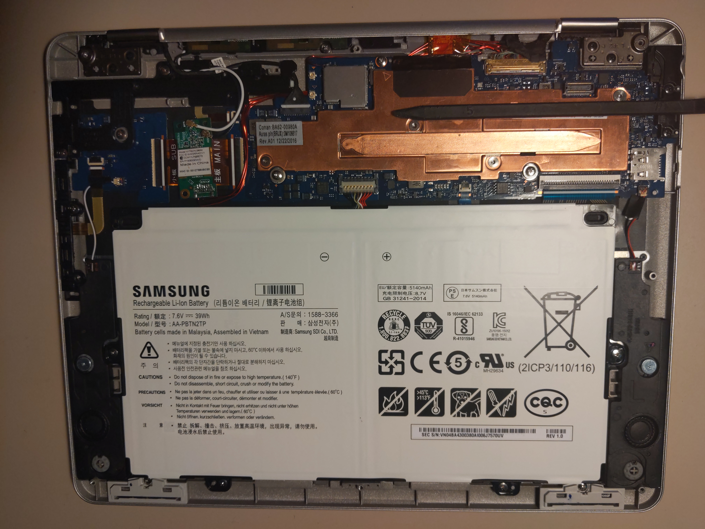

Be careful during reassembly to ensure the bottom case is snapped in properly. 
And we're done! 

Hope you enjoyed the read. Let me know if you end up doing something like this yourself.

You might also be interested in a privacy focused distro for this and some other arm based chromebooks with native support for these ar9271 adapters, csr8150 bluetooth, and no binary blobs. https://www.prawnos.com

- Hal

